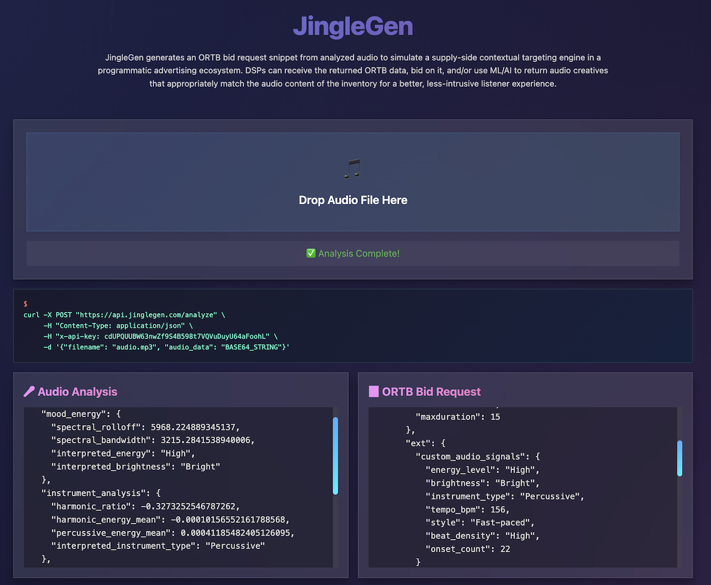

# JingleGen

Generates ORTB bid request snippet from analyzed audio to simulate a supply-side contextual targeting engine in a programmatic advertising ecosystem. Conceptually, a DSP could receive the returned ORTB data and by using ML/AI, returns an audio creative that appropriately matches the audio content of the viewer/listener. 


## Features (V2 - AWS Lambda API)

*   API endpoint for audio analysis.
*   Audio feature extraction (tempo, energy, mood, instruments) from uploaded audio.
*   Generation of ORTB bid request snippet. 

## Application Screenshot

*(The existing screenshot shows the UI from `/index.html`, which can be used to interact with the V2 API once deployed and the frontend is configured with the API endpoint.)*



 

**Prerequisites:**
*   Python 3.10.x
*   Librosa, NumPy, SciPy
*   AWS Lambda
*   AWS API Gateway
*   Amazon ECR (Elastic Container Registry) 
*   Docker

 
**API Request (Example):**

*   **Method:** `POST`
*   **Endpoint:** `/analyze`
*   **Body (JSON):**
    ```json
    {
        "audio_data": "<base64_encoded_string_of_your_audio_file>",
        "filename": "myaudio.mp3" 
    }
    ```

 
## Future Considerations / Next Steps

*   Implement more robust error handling and input validation.
*   Explore more advanced audio features.
*   Add authentication/authorization to the API Gateway endpoint.
*   Add AWS Transcribe for transcription of audio lyrics